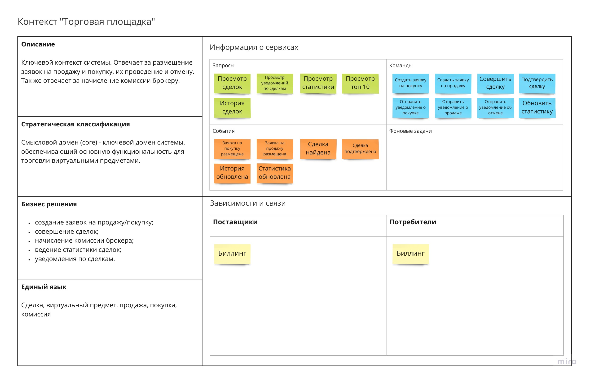
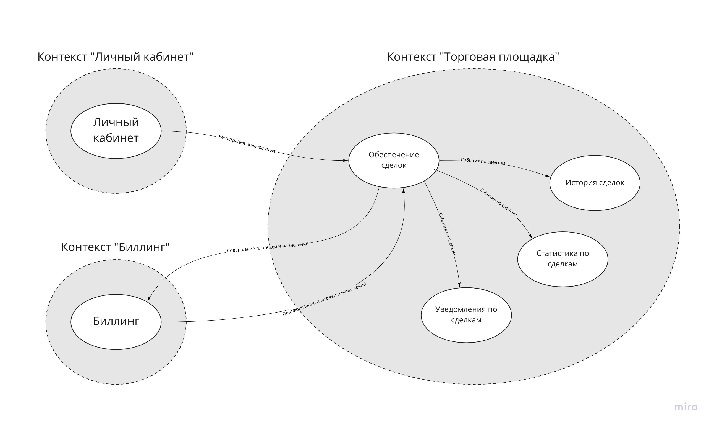

# Проектирование архитектуры

## Анализ бизнес-требований на основе Domain Driven Design

В качестве инструмента для анализа системы "Торговая площадка" был выбран подход Event storming из
методологии проектирования Domain Driven Design.

## Ключевые диаграммы взаимодействия с системой

### Проведение сделки по покупке

### Отмена сделки по покупке

### Проведение сделки по продаже

## Контексты

### Контекст "Личный кабинет"

### Контекст "Биллинг"

### Контекст "Торговая площадка"

## Предлагаемая структура микросервисов

## Схема взаимодействия сервисов

