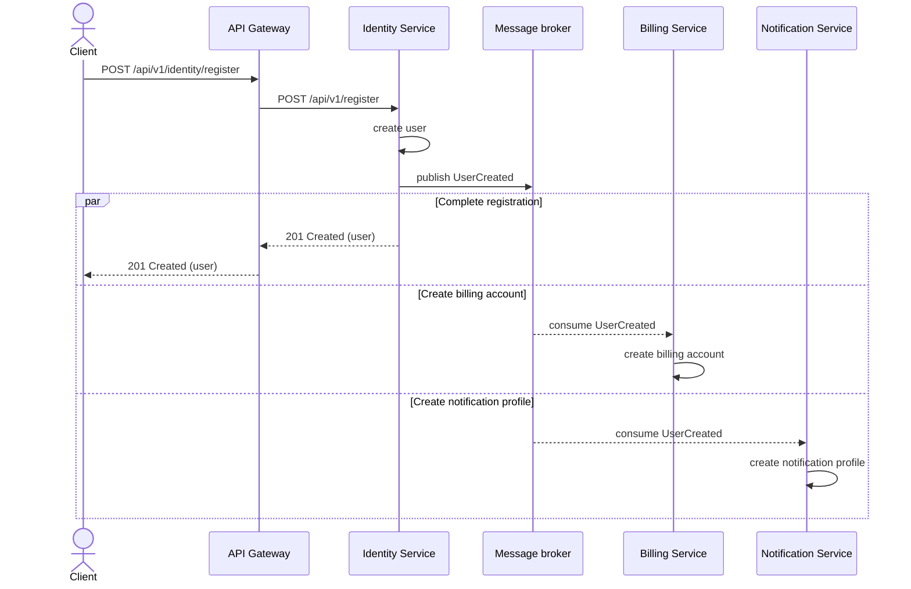
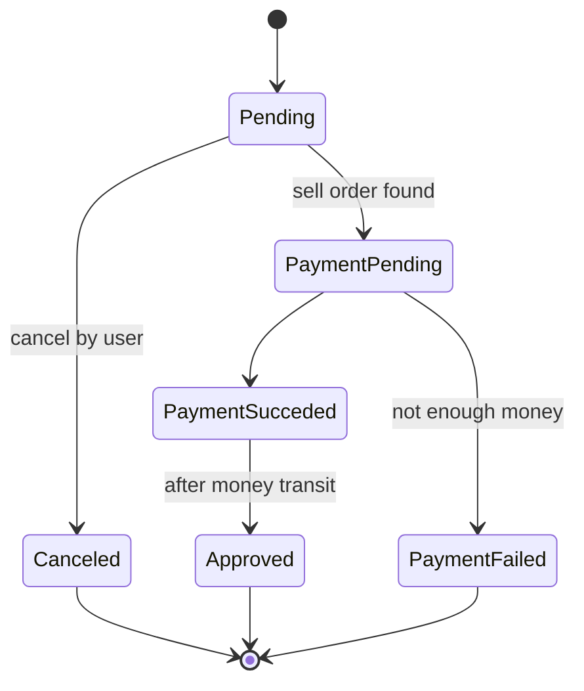
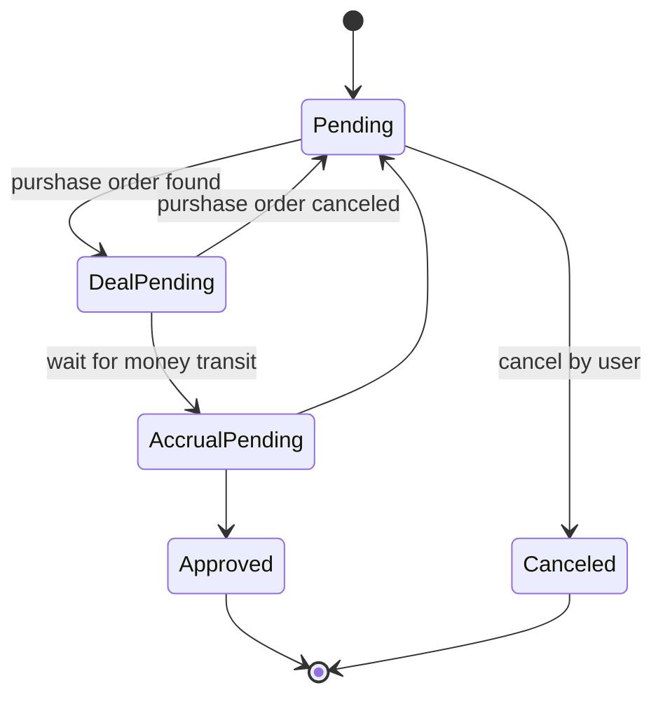
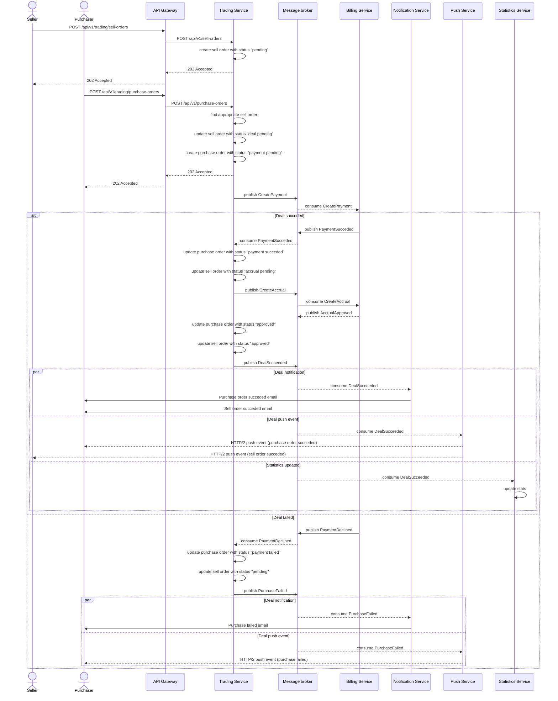

# Проектирование системы сделок

## Регистрация пользователя

## Диаграмма состояний заявки на покупку

## Диаграмма состояний заявки на продажу

## Осуществление сделки

## Структура сущностей

### Сущности торговой площадки

* виртуальный предмет (item)
  * id
  * name
  * initial price (стоимость при размещении)
  * commission (комиссия за сделку)
* заявка на продажу (sell order)
  * id
  * user id (nullable)
    * null в случае первичного размещения
  * item id
  * price - желаемая цена продажи
  * status
* заявка на покупку (purchase order)
  * id
  * user id
  * item id
  * price - желаемая цена покупки
  * status

### Сущности статистики торговой площадки

* сделки за день (daily stat)
  * date
  * item id
  * deals count - количество сделок за день
  * deals amount - общая сумма сделок за день
* топ сделок (top deals)
  * item id
  * deals count - количество сделок за день
  * deals amount - общая сумма сделок за день

### Сущности биллинга

* аккаунт (account)
  * id (= user id)
  * amount
* история баланса (balance history)
  * id
  * account id
  * type
    * deposit
    * withdraw
    * payment
    * accrual
  * amount 
