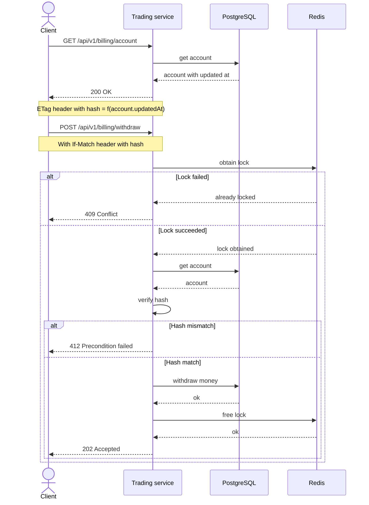
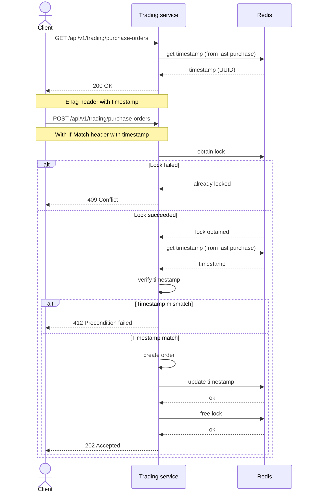

# Защита от гонок

## Идемпотентность операций биллинга



## Идемпотентность операций торговой площадки



## Осуществление сделок

Для подбора наиболее подходящей сделки из "стакана" (очереди заявок на продажу/покупку) используется блокировка строки
`FOR UPDATE` с пропуском заблокированных строк `SKIP LOCKED`. Таким образом исключается возможность
подбора одной сделки разными потоками. При этом потоки не блокируют друг друга и конкуретный
поток подберет следующую незаблокированную запись.

```postgresql
SELECT id, user_id, item_id, payment_id, deal_id, price, commission, status, created_at, updated_at
FROM "purchase_order"
WHERE item_id = $1 AND price <= $2 AND user_id != $3
ORDER BY price DESC
LIMIT 1 
FOR UPDATE SKIP LOCKED;
```
